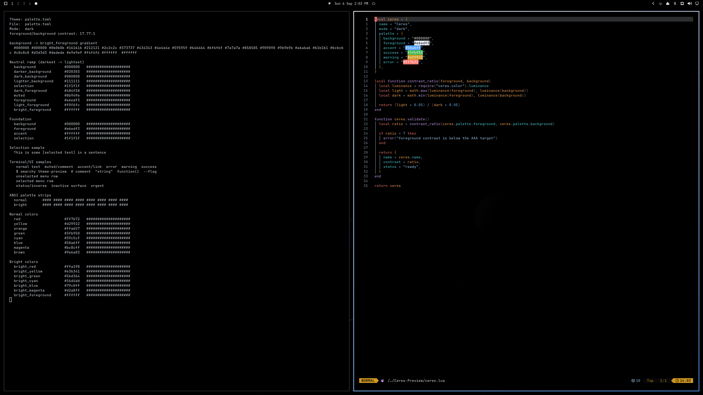

# Ceres

Ceres is a dark Omarchy theme built for OLED displays: true-black surfaces,
restrained monochrome chrome, and a small GitHub-blue focus signal.



## Install

```bash
omarchy theme install https://github.com/KigoJomo/omarchy-ceres-theme.git
```

Switch wallpapers with `Super + Ctrl + Space` or:

```bash
omarchy theme bg next
```

## Optional GTK extension

Omarchy does not install executable hooks from downloaded themes. The official
theme registry also omits GTK CSS files. Ceres keeps an optional, reviewable
hook in this repository that applies its GTK 3 and GTK 4 styling to apps such
as Files and Remmina. For a registry installation, copy the CSS files and hook
from this repository into the installed Ceres theme first:

```bash
git clone --depth 1 https://github.com/KigoJomo/omarchy-ceres-theme.git /tmp/ceres-gtk-extension
install -Dm644 /tmp/ceres-gtk-extension/gtk-3.0.css ~/.config/omarchy/themes/ceres/gtk-3.0.css
install -Dm644 /tmp/ceres-gtk-extension/gtk-4.0.css ~/.config/omarchy/themes/ceres/gtk-4.0.css
install -Dm755 /tmp/ceres-gtk-extension/scripts/ceres-gtk-theme-set ~/.config/omarchy/themes/ceres/scripts/ceres-gtk-theme-set
install -Dm755 /tmp/ceres-gtk-extension/scripts/install-gtk-extension ~/.config/omarchy/themes/ceres/scripts/install-gtk-extension
```

Then run:

```bash
~/.config/omarchy/themes/ceres/scripts/install-gtk-extension
```

Reopen running GTK apps after installing or switching themes. The hook will not
overwrite unrelated `~/.config/gtk-3.0/gtk.css` or
`~/.config/gtk-4.0/gtk.css` files. Re-run the installer after updating Ceres so
the installed hook matches the new version. Remove it with:

```bash
~/.config/omarchy/themes/ceres/scripts/uninstall-gtk-extension
```

## Design and coverage

- OLED-black primary surfaces with subtle `#080808` and `#111111` elevation.
- White controls and a muted, solid white focused-window edge.
- Neutral persistent selections and blue text selections for clarity.
- GitHub Dark-inspired semantic colors for code, diffs, warnings, and links.
- Yaru-blue icons and matching Plymouth unlock artwork.
- Hand-tuned Helix, VS Code-compatible, GTK 3, and GTK 4 themes.

For downloaded themes, Omarchy generates terminal, Hyprland, Neovim, btop,
Chromium, Obsidian, and shell configurations from `colors.toml`. That keeps the
install safe and makes the palette consistent across supported apps.

## Wallpapers

The seven wallpapers in `backgrounds/` ship with Ceres. To add more personal
wallpapers, put images that you have the right to use in:

```text
~/.config/omarchy/backgrounds/ceres/
```

They appear alongside the bundled Ceres wallpapers without becoming part of
the theme repository.

## License and credits

The repository is released under the [MIT License](LICENSE). See
[THIRD_PARTY_NOTICES.md](THIRD_PARTY_NOTICES.md) for design references and
[ASSETS.md](ASSETS.md) for bundled image provenance.
